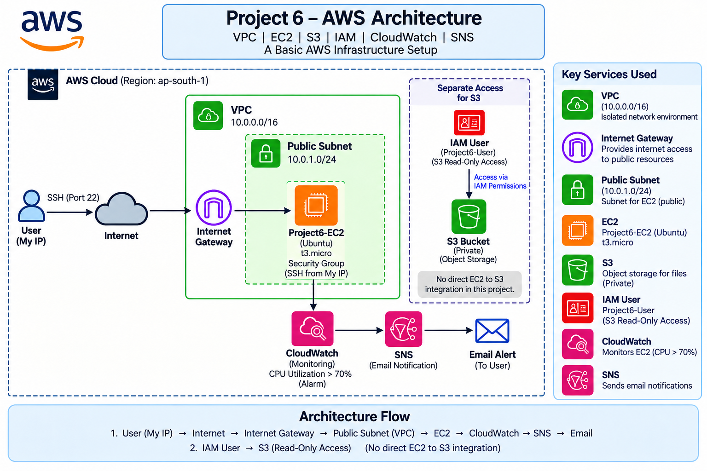

# AWS Architecture — Project 6

## 1. Architecture Overview

This project implements a small AWS infrastructure environment using a custom VPC, public subnet, Internet Gateway, EC2, S3, IAM, CloudWatch, and SNS.

The architecture was built manually to understand how networking, compute, storage, identity, and monitoring components work together in AWS.

## 2. Architecture Diagram



## 3. Network Architecture

The network layer consists of:

- **VPC:** `Project6-VPC`
- **VPC CIDR:** `10.0.0.0/16`
- **Public Subnet:** `Project6-Public-Subnet`
- **Subnet CIDR:** `10.0.1.0/24`
- **Internet Gateway:** `Project6-IGW`
- **Route Table:** `Project6-Public-RT`

The public subnet is explicitly associated with the project route table.

The route table contains:

- **Destination:** `0.0.0.0/0`
- **Target:** `Project6-IGW`

This route allows traffic from the public subnet to reach the internet through the Internet Gateway.

## 4. Compute Architecture

The compute layer consists of one Ubuntu EC2 instance deployed inside the public subnet.

- **Instance:** `Project6-EC2`
- **Operating System:** Ubuntu
- **Instance Type:** `t3.micro`
- **Public IP:** Enabled
- **Subnet:** `Project6-Public-Subnet`
- **Security Group:** `Project6-EC2-SG`

The EC2 instance provides the server/compute environment for the project.

## 5. Network Security

The EC2 instance is protected using a Security Group:

- **Security Group:** `Project6-EC2-SG`
- **Inbound:** SSH (Port 22)
- **Source:** My IP
- **Outbound:** Default allow

Restricting SSH access to My IP reduces unnecessary exposure of the management port.

## 6. Internet Traffic Flow

The internet connectivity path is:

```text
Internet
   |
   v
Internet Gateway
   |
   v
Project6-VPC
   |
   v
Project6-Public-Subnet
   |
   v
Project6-EC2
```

The public subnet uses the route table containing:

```text
0.0.0.0/0 → Project6-IGW
```

This makes the subnet capable of reaching the internet through the Internet Gateway.

## 7. Storage Architecture

Amazon S3 is used as a separate object storage service.

The bucket was configured with:

- **Block Public Access:** Enabled
- **ACLs:** Disabled / Bucket owner enforced
- **Sample Object:** `project6-sample.txt`

The bucket was intentionally kept private.

No direct EC2-to-S3 application integration was configured in this project.

## 8. Identity and Access Architecture

An IAM user was created for controlled AWS access:

- **IAM User:** `Project6-User`
- **Permission:** `AmazonS3ReadOnlyAccess`

The user demonstrates how permissions can be assigned according to the required access instead of providing unrestricted administrator permissions.

The project also used an IAM role for EC2-based AWS CLI access.

The EC2 instance was able to obtain AWS identity information using:

```bash
aws sts get-caller-identity
```

This approach avoids storing long-lived AWS access keys directly on the EC2 instance.

## 9. Monitoring Architecture

Amazon CloudWatch was configured to monitor the EC2 instance.

The monitoring setup uses the `CPUUtilization` metric.

Alarm configuration:

- **Metric:** `CPUUtilization`
- **Statistic:** Average
- **Period:** 5 minutes
- **Threshold:** Greater than 70%
- **Datapoints:** 1 out of 1
- **Alarm:** `Project6-EC2-CPU-Above-70`

## 10. Alerting Flow

The monitoring and notification flow is:

```text
EC2
 |
 | CPUUtilization
 v
CloudWatch
 |
 | CPU > 70%
 v
CloudWatch Alarm
 |
 v
SNS Topic
 |
 v
Email Notification
```

SNS topic:

```text
project6-cloudwatch-alert
```

The SNS topic is used as the notification destination for the CloudWatch alarm.

## 11. Supporting Services

The architecture contains four main supporting functions:

| Service | Role |
|---|---|
| IAM | Controls user and service permissions |
| S3 | Provides private object storage |
| CloudWatch | Monitors EC2 performance |
| SNS | Delivers CloudWatch alarm notifications |

## 12. End-to-End Architecture

The complete architecture can be summarized as:

```text
                         AWS CLOUD
                             |
                     Project6-VPC
                     10.0.0.0/16
                             |
                    Public Subnet
                    10.0.1.0/24
                             |
                         EC2
                      Project6-EC2
                             |
                       CloudWatch
                             |
                      CPU > 70%
                             |
                           SNS
                             |
                    Email Notification


        Project6-User
              |
              v
      S3 Read-Only Access
              |
              v
       Private S3 Bucket
```

## 13. Architecture Verification

The EC2 instance was successfully connected through SSH.

Internet connectivity was verified from the EC2 instance using:

```bash
curl -I https://aws.amazon.com
```

The response returned:

```text
HTTP/2 200
```

This confirmed that the EC2 instance could successfully communicate with the internet through the configured VPC networking.

## 14. Architecture Design Notes

This project intentionally uses a simple architecture suitable for learning and demonstration.

The environment contains one public subnet and one EC2 instance. A private subnet, NAT Gateway, load balancer, database, and Auto Scaling were not included because they were outside the scope of this mini project.

The architecture can be extended in the future with private subnets, databases, load balancing, Auto Scaling, VPC endpoints, and more advanced monitoring.
